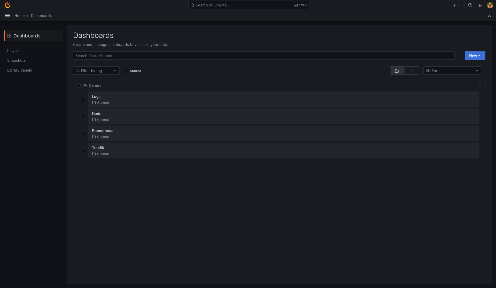
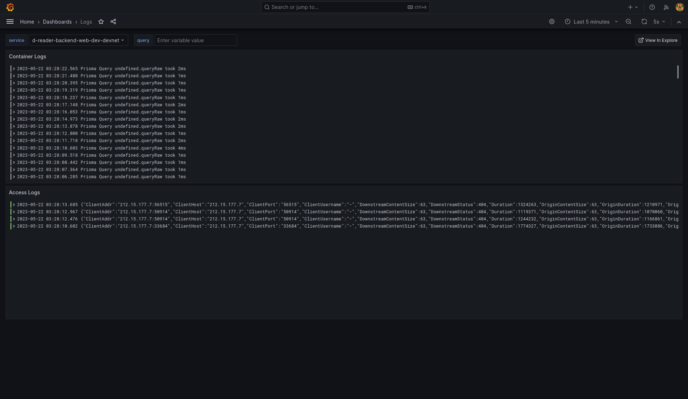
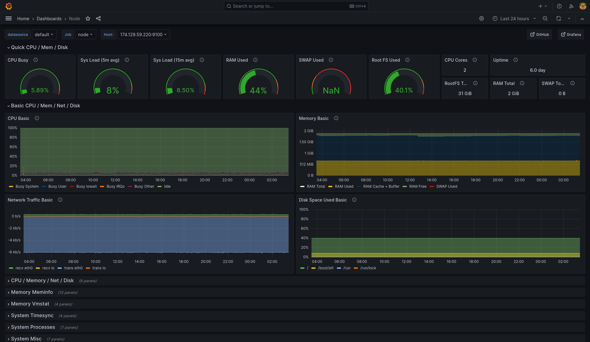
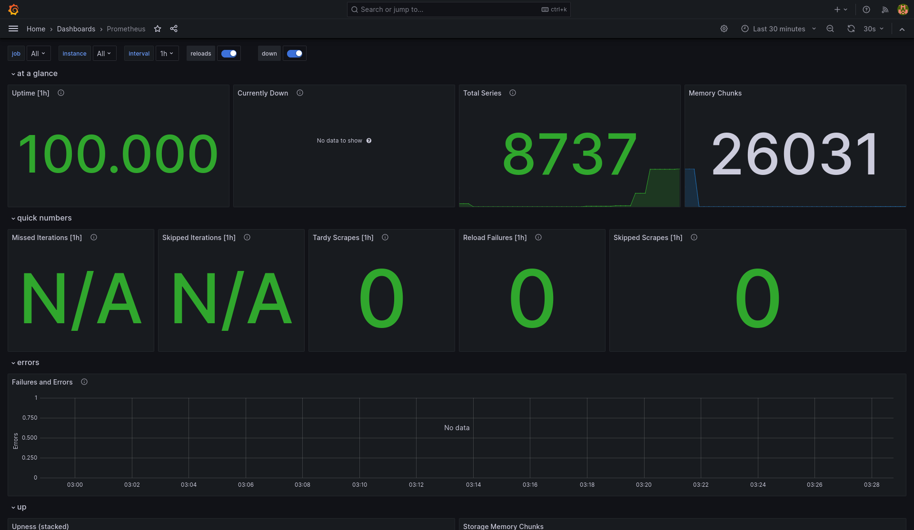
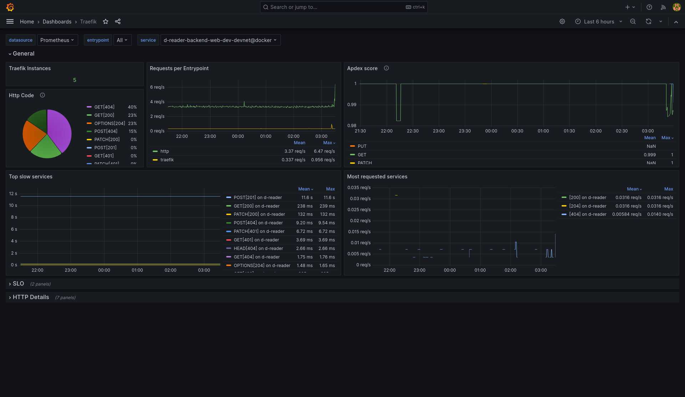
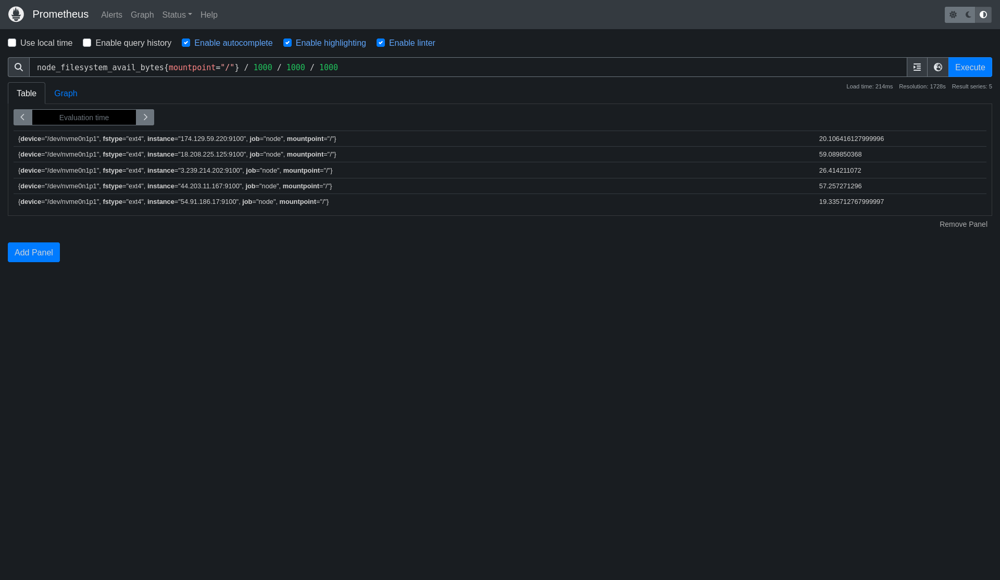
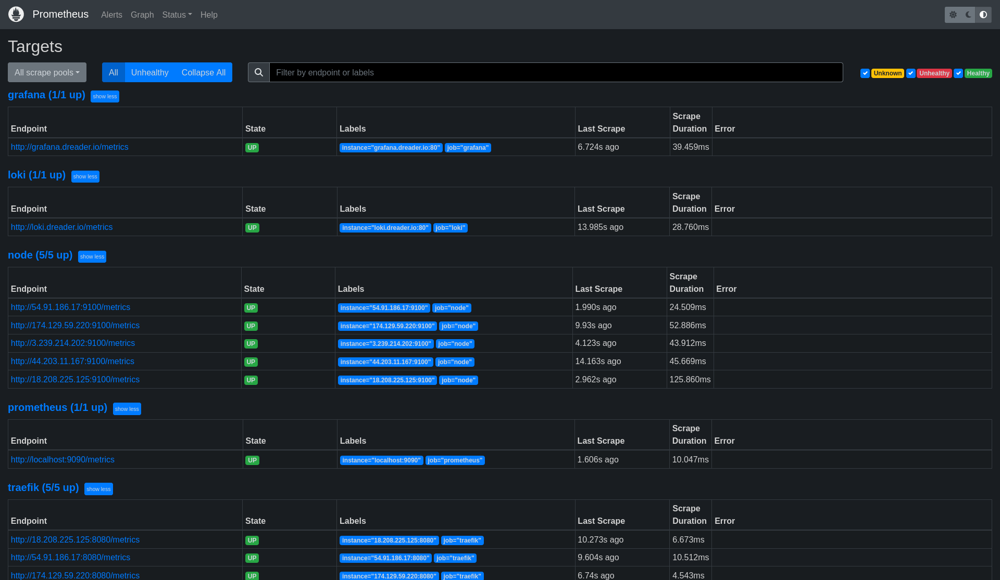
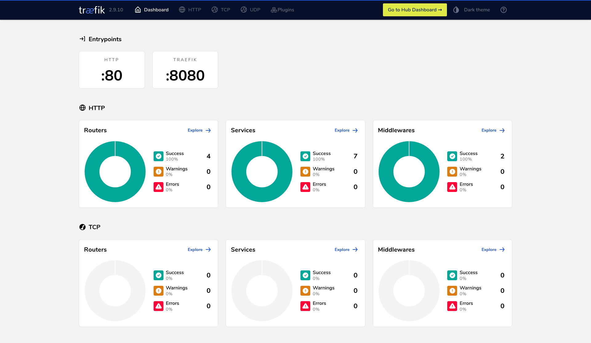
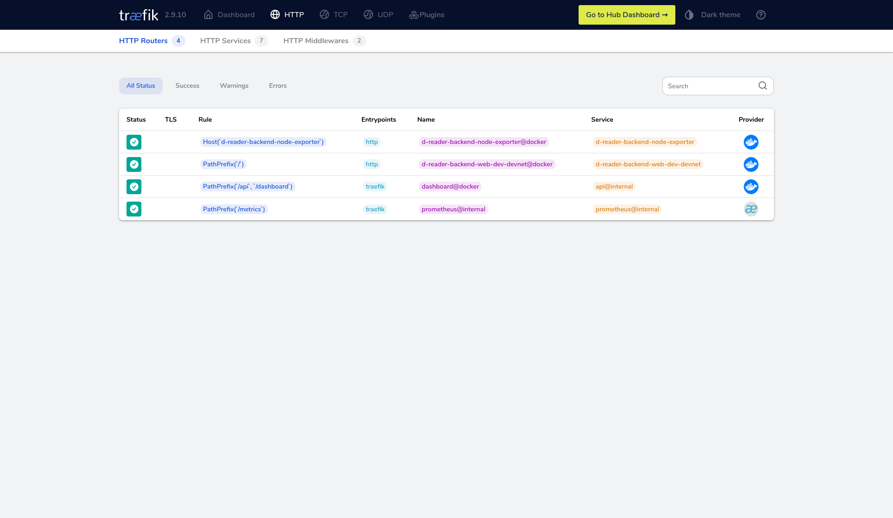

# Deployment Guide

Docs for managing and using deployment infrastructure.

## Environment

### Environment access setup

Required programs:
- [`sops`](https://github.com/mozilla/sops/releases/latest) - sops is simple and flexible tool for managing secrets in git repositories
- [`age`](https://github.com/FiloSottile/age#installation) - age is a simple, modern and secure file encryption tool, think of this like ssh keys but for encrypting files

Create age key:
- Linux:
  ```sh
  mkdir -p ~/.config/sops/age
  age-keygen -o ~/.config/sops/age/keys.txt
  ```
- MacOS:
  ```sh
  mkdir -p ~/Library/Application\ Support/sops/age
  age-keygen -o ~/Library/Application\ Support/sops/age/keys.txt
  ```
- Windows:
  ```bat
  md %AppData%\sops\age
  age-keygen -o %AppData%\sops\age\keys.txt
  ```

Send your public key (it's one with age prefix) to administrator and wait for
them to add you in `.sops.yaml`. After that change gets in repository, do git
pull and then you will be able to edit environment variables. See how in
[next](#how-to-edit-environment-variable) section.

### How to edit environment variable

If you don't have environment access up and running, take a look at
[this](#environment-access-setup) section.

> **Warning** Environment variable that contain special characters like `#` or
> `$` need to be wrapped in single quotes to prevent shell expansion

Edit encrypted .env file (it will be saved when you exit vscode tab):
```sh
EDITOR="code --wait" sops config/env/dev-devnet.enc.env
```

Edit `env:` in `config/deploy.yml` if secrets were removed or new ones were
added.

## Deployment

### How to deploy from local machine

> **Warning** Deployment from local machine is not needed in most cases as
> deploy will automatically run on every push to `dev` and `main` branch.
> This is mostly used for testing or managing monitoring infrastructure.

Before deploy make sure you've completed environment access setup.

Required programs:
- [`mrsk`](https://github.com/mrsked/mrsk#installation) - mrsk is tool that deploys web apps anywhere from bare metal to cloud VMs using Docker with zero downtime

```sh
./config/scripts/mrsk.sh dev-devnet deploy -r web
```

View app logs from terminal:
```sh
./config/scripts/mrsk.sh dev-devnet app logs -f
```

Restart grafana/prometheus/loki service:
```sh
./config/scripts/mrsk.sh monitoring accessory reboot prometheus
```

### How to add/remove/replace server

Before editing server list make sure that new server is accessible with its
environment's ssh key for `root` user. Easy way to verify:

```sh
# load environment's key in ssh-agent
./config/scripts/ssh-agent.sh load dev-devnet

# test ssh connection
ssh root@new_server_ip
```

After you've verified that ssh connection is working, edit ip address list
section `servers.web.hosts:` in `config.<env>.yml`.

## Monitoring

### Grafana

[Grafana](https://github.com/grafana/grafana) allows you to query, visualize,
alert on and understand your metrics no matter where they are stored.

Accessible on [grafana.dreader.io](https://grafana.dreader.io) (auth required).

<details>
  <summary>Dashboards</summary>

  <https://grafana.dreader.io/dashboards>

  
</details>
<details>
  <summary>Logs dashboard</summary>

  <https://grafana.dreader.io/d/f67ab2d6-1497-4290-b318-b902a799f30e/logs>

  
</details>
<details>
  <summary>System stats (node) dashboard</summary>

  <https://grafana.dreader.io/d/rYdddlPWk/node>

  
</details>
<details>
  <summary>Prometheus dashboard</summary>

  <https://grafana.dreader.io/d/c450b3e5-139e-4766-b3b8-dcd8e03fc553/prometheus>

  
</details>
<details>
  <summary>Traefik dashboard</summary>

  <https://grafana.dreader.io/d/n5bu_kv45/traefik>

  
</details>

### Prometheus

[Prometheus](https://github.com/prometheus/prometheus) is a systems and service
monitoring system. It collects metrics from configured targets at given
intervals.

Accessible on [prometheus.dreader.io](https://prometheus.dreader.io) (auth required).

<details>
  <summary>Data Explorer</summary>

  <https://prometheus.dreader.io/graph>

  
</details>
<details>
  <summary>Targets</summary>

  <https://prometheus.dreader.io/targets>

  
</details>

### Traefik

[Traefik](https://github.com/traefik/traefik) is a modern HTTP reverse proxy and
load balancer that makes deploying microservices easy. Traefik integrates with
your existing infrastructure components and configures itself automatically and
dynamically.

It also provides read-only dashboard for each server instance that is used to
see current traefik configuration state.

Accessible on http://server_ip:8080/dashboard/ (auth required).

<details>
  <summary>Dashboard</summary>

  - <http://54.91.186.17:8080/dashboard/> (dev-devnet)
  - <http://174.129.59.220:8080/dashboard/> (dev-mainnet)
  - <http://3.239.214.202:8080/dashboard/> (main-devnet)
  - <http://44.203.11.167:8080/dashboard/> (main-mainnet)
  - <http://18.208.225.125:8080/dashboard/> (monitoring)

    
</details>
<details>
  <summary>Routers</summary>

  - <http://54.91.186.17:8080/dashboard/#/http/routers> (dev-devnet)
  - <http://174.129.59.220:8080/dashboard/#/http/routers> (dev-mainnet)
  - <http://3.239.214.202:8080/dashboard/#/http/routers> (main-devnet)
  - <http://44.203.11.167:8080/dashboard/#/http/routers> (main-mainnet)
  - <http://18.208.225.125:8080/dashboard/#/http/routers> (monitoring)

  
</details>